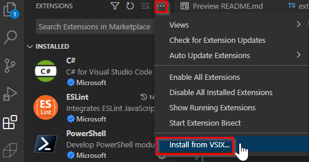
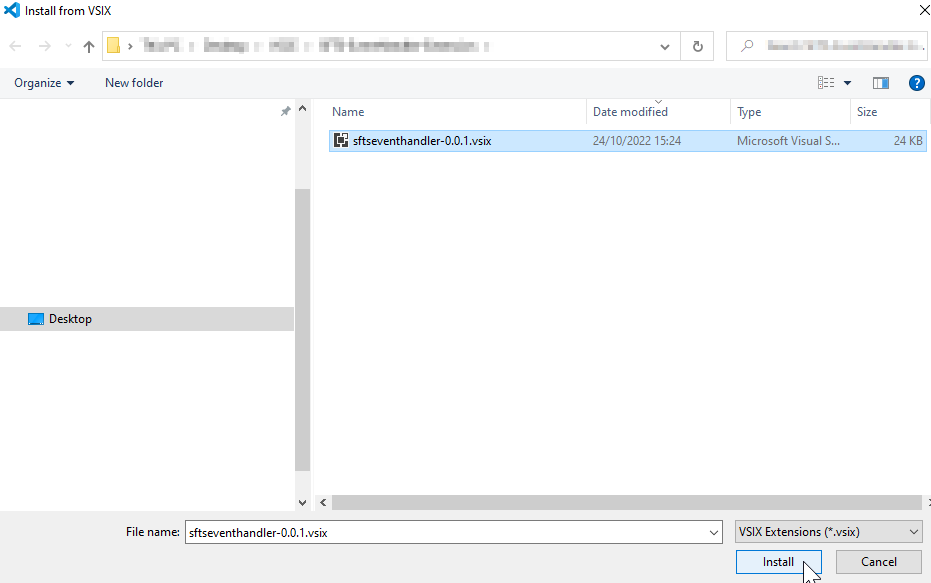
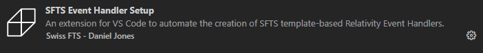

# SFTS Event Handler Extension
An extension for VS Code to automate the creation of SFTS template-based Relativity Event Handlers.

Features easy setup of environment, generation of custom templates, and builds the **.dll** by clicking the respective buttons.

## Installation
Import the `.vsix` into VS Code by heading to the Extensions tab, clicking the three dots, and selecting 'Install from VSIX...'.

Select the `.vsix` file to install it into VS Code.

The extension is now installed and can be accessed via the side panel.

## How to use

## Development
Fork the repository and install node_modules using `npm install`. The core logic of the extension is contained in `extension.ts`. Within VS Code, you can debug the extension by pressing `F5` ('Start Debugging'). After you've made changes, use `vsce package` to build the `.vsix` file.

## Dependencies
* VS Code v**1.72.2** - Sadly VS Code extensions don't play nice with older versions, though newer versions should not pose a problem.
* Node JS v**16.17.1**
* Npm v**8.19.2**